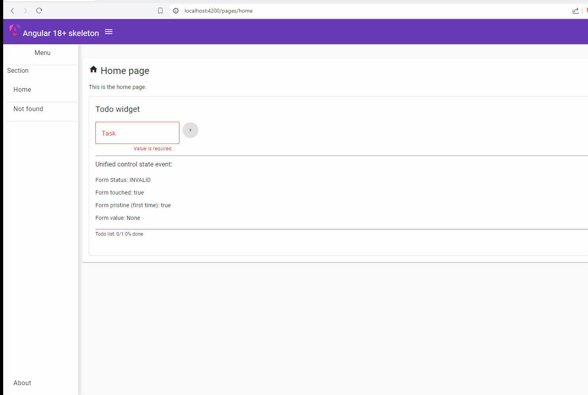

# Django 5+ Skeleton
===
Django 5+ starter kit to develop an API REST/WS using Django, PostgreSql, Docker, Kubernetes.
Project template starter with Django 5+ basic features, good practices and development toolkit for CICD, code format, linter, documentation, scaffolding, tests, security, performance audit and troubleshoots.
- version alpha 0.1

> **Alert note:**  This application is for demonstration purpose only and it is not intended for use in a specific production. It is too generic and not designed to be particularly efficient, stable, or secure. It does not support all the required features and specific needs of a complete production-ready solution !

---

# Table of Contents

- [Overview](#overview)
- [Setup](#setup)
- [Usage](#usage)
  - [Development server](#development-server)
  - [Debugging on Chrome browser](#debugging-on-chrome-browser)
  - [Code scaffolding](#code-scaffolding)
  - [Build](#build)
- [Further help](#further-help)
  - [Running unit tests](#running-unit-tests)
  - [Running end-to-end tests](#running-end-to-end-tests)
  - [Running code format](#running-code-format)
  - [Running code quality](#running-code-quality)
  - [Running code performance](#running-code-performance)
  - [Running code security](#running-code-security)
  - [Optional: Generate mermaid diagrams](#optional-generate-mermaid-diagrams)

# Overview

---

**5 main Features:**

1- **Django skeleton:** Project template starter using Django framework and development toolkit.

2- **Data model and database :** using PostgreSql

3- **Unit, integration and e2e Tests:** Unit test code samples using Jest and  e2e test code samples.

4- **Technical documentation:** Docs, guidelines using Markdown and diagrams using Mermaid.

5- **CICD:** Docker containerization and Kubernetes orchestration

---

# Setup

---

---

# Usage
---

## Development server

## Debugging on Chrome browser

## Code scaffolding

## Build

## Running unit tests

## Running end-to-end tests

## Further help

### Environment

### Running code format

### Running code quality

### Running code performance

### Running code security

### Optional: Generate mermaid diagrams

Install globally `npm install -g @mermaid-js/mermaid-cli`
Run `npm run diagram-file` to generate diagrams file for markdown file via [Mermaid cli](https://github.com/mermaid-js/mermaid-cli)